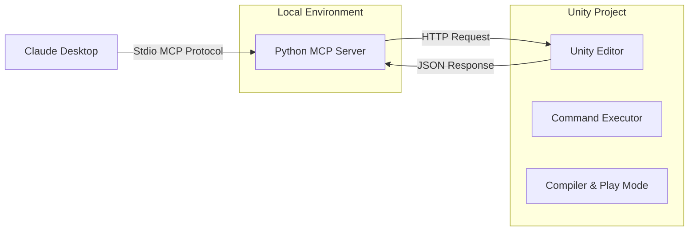

# 🎮 UnityMCP: Agentic Game Development Interface

> **Build Unity games by chatting with Claude.**  
> A bridge between Claude Desktop (via MCP) and the Unity Editor, enabling an agentic workflow for game creation.

  

## 🌟 Overview

**UnityMCP** is a system that allows LLM agents (specifically Claude Desktop) to "drive" the Unity Editor. Unlike simple code assistants, UnityMCP allows the agent to:
1.  **See the Scene**: Retrieve snapshots of the hierarchy, inspecting components, variables, and positions.
2.  **Manipulate Objects**: Create, destroy, move, and modify GameObjects deterministically.
3.  **Write Code**: Generate C# scripts that compile and attach automatically.
4.  **Run Tests**: Enter Play Mode asynchronously, wait for completion, and capture Runtime exceptions.

It is designed to be **Resilient**: it handles Unity domain reloads, compilation locks, and server disconnects gracefully.

---

## 🏗 Architecture

The system consists of two parts communicating over HTTP:



- **Unity Side (C#)**: A `HttpListener` running inside the Editor (`localhost:7777`). It executes Main Thread commands, handles script compilation, and manages Play Mode.
- **Client Side (Python)**: A FastMCP server that connects Claude to Unity. It handles protocol translation and error recovery.

---

## 🚀 Getting Started

### 1. Unity Setup
1.  Open the `unity/UnityMCPProject` folder in Unity 2022.3+.
2.  Wait for import.
3.  In the top menu, click **Tools > UnityMCP > Start Server**.
    - *You should see `[UnityMCP] Server started at http://127.0.0.1:7777` in the Console.*

### 2. Python Setup
The project uses `uv` or `pip` (handled by the startup script). Ensure you have Python 3.11+ installed.

### 3. Claude Desktop Configuration
Edit your config file:
- **macOS**: `~/Library/Application Support/Claude/claude_desktop_config.json`
- **Windows**: `%APPDATA%\Claude\claude_desktop_config.json`

Add this entry (update the path):
```json
{
  "mcpServers": {
    "unitymcp": {
      "command": "/bin/bash",
      "args": [
        "/ABSOLUTE/PATH/TO/unitymcp/mcp_unitymcp/scripts/run_server.sh"
      ],
      "env": {
        "UNITYMCP_URL": "http://127.0.0.1:7777"
      }
    }
  }
}
```
*Restart Claude Desktop after saving.*

---

## 💡 The Agentic Workflow

To get the best results, use this **Loop** when prompting Claude:

### 1. 📡 Ping & Monitor
Always start by checking connections.
> *"Call unity_ping and unity_snapshot. What needs to be done?"*

### 2. 📝 Plan First
Don't let the agent guess. Ask for a plan.
> *"Propose 3 steps to build the movement system. Do not write code yet."*

### 3. 🔨 Apply Single Feature
Build one component at a time to isolate errors.
> *"Implement Feature 1: The Player Controller. Create the object, write the script, wait for compile, then attach."*

### 4. ✅ Verify
Run Play Mode to prove it works.
> *"Run Play Mode for 5 seconds. Check for compiler errors and runtime exceptions."*

---

## 🛠 Features

| Feature | Description | Tool |
| :--- | :--- | :--- |
| **State Inspection** | Get a JSON snapshot of the active scene hierarchy. | `unity_snapshot` |
| **Safe Scripting** | Write scripts to `Assets/Generated/` with auto-refresh. | `unity_write_script` |
| **Compilation Gate** | Check compiler errors before running logic. | `unity_compiler_errors` |
| **Async Play Mode** | Run the game for N seconds and capture logs. | `unity_play_run` |
| **Object Control** | Create primitives, set transforms, attach components. | `unity_apply` |

---

## 🛡 Stability & Security
- **Localhost Only**: The server binds only to `127.0.0.1` for security.
- **Auto-Restart**: The Unity server survives domain reloads (recompilation) automatically via `EditorPrefs`.
- **Thread Safety**: All commands are dispatched to the Unity Main Thread.
- **Stdio Isolation**: The Python server suppresses stdout to prevent MCP protocol corruption.

---

*(c) 2026 UnityMCP Project*
