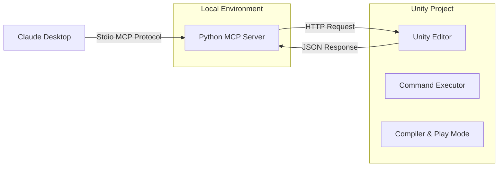
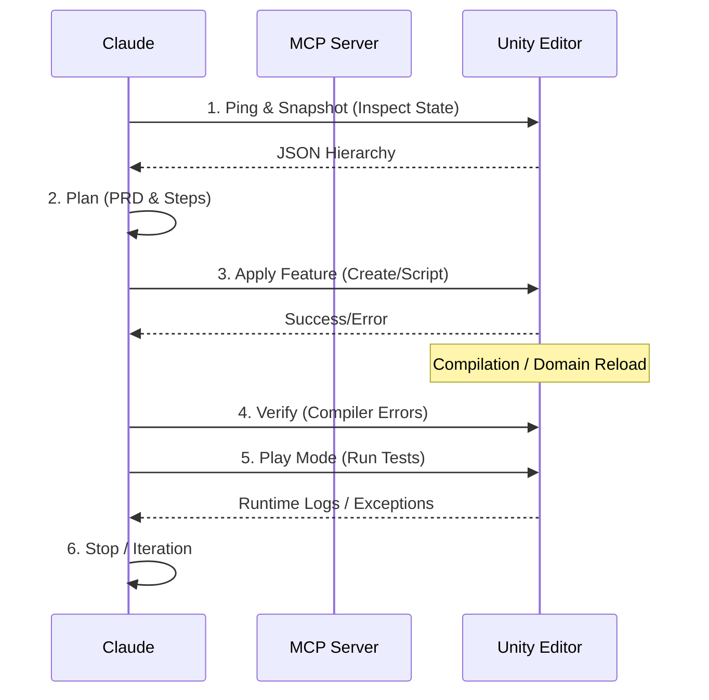

# 🎮 UnityMCP: Agentic Game Development Interface

> **Build Unity games by chatting with Claude.**  
> A bridge between Claude Desktop (via MCP) and the Unity Editor, enabling an agentic workflow for game creation.

  

## 📄 Abstract

Large language models are increasingly used to assist game development, yet their reliability degrades in interactive, stateful environments such as game engines, where compilation delays, domain reloads, and runtime failures disrupt linear generation workflows. Prior systems such as *DreamGarden* address this challenge through hierarchical planning trees that expose generation structure to users for mixed-initiative control.

We present **UnityMCP**, a second-generation agentic interface that reinterprets hierarchical planning for engine-in-the-loop execution. Rather than exposing a planning tree through a graphical interface, UnityMCP encodes hierarchical intent implicitly as a sequence of verification-gated feature commitments enforced at the protocol level. Each feature advances only after the Unity engine confirms successful compilation and runtime execution, ensuring that the agent’s internal plan reflects executable reality rather than speculative intent.

UnityMCP bridges a desktop LLM agent and the Unity Editor via a lightweight command server, exposing structured operations for scene inspection, deterministic object manipulation, code generation, compilation checks, and bounded Play Mode execution. This interaction loop—inspect, plan, apply, verify—enables robust recovery from partial failures such as domain reloads and asynchronous aborts, while preserving user control through constrained natural-language directives.

By relocating hierarchical enforcement from an explicit UI to a verification-first protocol, UnityMCP isolates the role of automated reliability gates in agentic game development. We argue that this shift improves trust calibration, reduces cascading errors, and provides a clearer experimental foundation for studying agent behavior in real-world creative tools.

---

## 🏛 Theoretical Framework: Implicit Execution Trees

UnityMCP shifts the paradigm from **Explicit Planning Trees** (intent-based) to **Implicit Execution Trees** (truth-based).

| Concept | DreamGarden (Prior Art) | UnityMCP (This Work) |
| :--- | :--- | :--- |
| **Node Semantics** | Conceptual subgoals (mechanics, rules, assets) | **Executable features** that must compile and run. |
| **Edge Semantics** | User-accepted plan transitions | **Verification-gated transitions** (Compiler Empty → Play Mode Success). |
| **Pruning Mechanism** | UI-based subtree toggling | **State-level rollback** (deterministic deletion, domain reload recovery). |
| **User Control** | Direct tree manipulation | **Protocol-level constraints expressed in language**. |
| **Failure Model** | Implicit, user-visible | **Explicit, system-enforced, recoverable**. |

### Engine-in-the-Loop Truthfulness
UnityMCP refuses to represent states that the engine has not validated. Unlike planning trees which may visualize speculative intent, UnityMCP's protocol ensures the "tree" only exists as a history of **proven engine states**.

---

## 🏗 System Architecture

The system consists of two parts communicating over HTTP, ensuring separation of concerns between the agent environment and the runtime engine.



---

## 🔄 The Agentic Protocol

UnityMCP enforces a formal interaction loop to ensure reliability in a stateful environment.



---

## 🛡 Failure Resilience & Taxonomy

| Failure Type | Example Scenario | UnityMCP Handling Strategy |
| :--- | :--- | :--- |
| **Domain Reload** | Script recompilation unloads assemblies. | **Auto-Restart**: Server persists via `EditorPrefs` and restarts automatically. |
| **Async Abort** | Play Mode thread killed by reload. | **Graceful Catch**: `ThreadAbortException` is caught and logged as warning only. |
| **Compilation Lock** | Agent tries to run while compiling. | **Gating**: `unity_compiler_errors` tool forces agent to wait before execution. |
| **Partial State** | Object created but script failed. | **Deterministic Cleanup**: `DestroyByName` allows rigorous state reset. |

---

## 🚀 Getting Started

### 1. Unity Setup
1.  Open the `unity/UnityMCPProject` folder in Unity 2022.3+.
2.  Wait for import.
3.  In the top menu, click **Tools > UnityMCP > Start Server**.

### 2. Python Setup
The project uses `uv` or `pip` (handled by the startup script). Ensure you have Python 3.11+ installed.

### 3. Claude Desktop Configuration
Edit your config file:
- **macOS**: `~/Library/Application Support/Claude/claude_desktop_config.json`
- **Windows**: `%APPDATA%\Claude\claude_desktop_config.json`

Add this entry (update the path):
```json
{
  "mcpServers": {
    "unitymcp": {
      "command": "/bin/bash",
      "args": [
        "/ABSOLUTE/PATH/TO/unitymcp/mcp_unitymcp/scripts/run_server.sh"
      ],
      "env": {
        "UNITYMCP_URL": "http://127.0.0.1:7777"
      }
    }
  }
}
```

---

*(c) 2026 UnityMCP Research*
