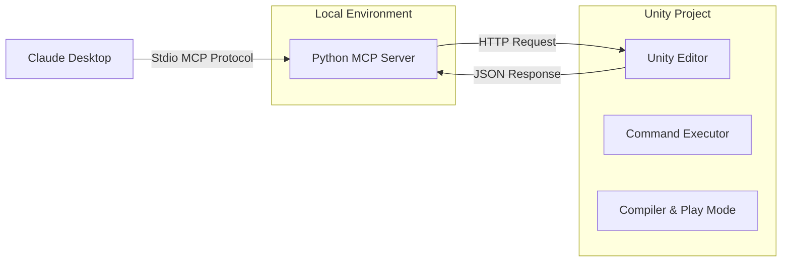
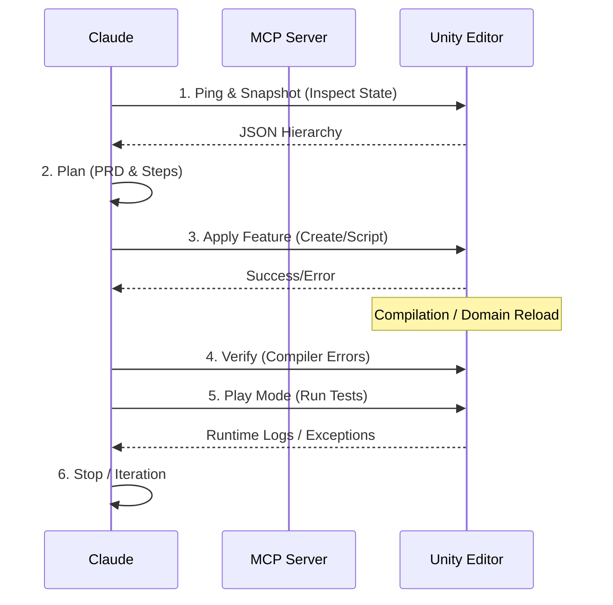

# 🎮 UnityMCP: Agentic Game Development Interface

> **Build Unity games by chatting with Claude.**  
> A bridge between Claude Desktop (via MCP) and the Unity Editor, enabling an agentic workflow for game creation.

  

## 📄 Abstract

Large language models are increasingly used to assist software development, yet their performance degrades sharply in interactive, stateful environments such as game engines, where compilation delays, domain reloads, and asynchronous execution disrupt linear workflows. We present **UnityMCP**, an agentic interface that enables language-model agents to incrementally construct and verify features inside a live Unity editor through a constrained, failure-aware interaction protocol.

UnityMCP bridges an LLM agent and the Unity Editor via a lightweight command server, exposing structured operations for scene inspection, object manipulation, code generation, compilation checks, and controlled Play Mode execution. Rather than optimizing for autonomous generation, the system enforces a disciplined loop—inspect, plan, apply, verify—that prevents cascading errors and enables recovery from partial failures.

---

## 🏗 System Architecture

The system consists of two parts communicating over HTTP, ensuring separation of concerns between the agent environment and the runtime engine.



- **Unity Side (C#)**: A `HttpListener` running inside the Editor (`localhost:7777`). It executes Main Thread commands, handles script compilation, and manages Play Mode.
- **Client Side (Python)**: A FastMCP server that connects Claude to Unity. It handles protocol translation and error recovery.

---

## 🔄 The Agentic Protocol

UnityMCP enforces a formal interaction loop to ensure reliability in a stateful environment.



To get the best results, use this **Loop** when prompting:
1.  **Ping & Monitor**: *"Call unity_ping and unity_snapshot. What needs to be done?"*
2.  **Plan First**: *"Propose 3 steps to build the movement system. Do not write code yet."*
3.  **Apply Single Feature**: *"Implement Feature 1. Create the object, write the script, wait for compile, then attach."*
4.  **Verify**: *"Run Play Mode for 5 seconds. Check for compiler errors and runtime exceptions."*

---

## 🛡 Failure Resilience & Taxonomy

UnityMCP changes the paradigm from "stateless code generation" to "stateful failure recovery".

| Failure Type | Example Scenario | UnityMCP Handling Strategy |
| :--- | :--- | :--- |
| **Domain Reload** | Script recompilation unloads assemblies. | **Auto-Restart**: Server persists via `EditorPrefs` and restarts automatically. |
| **Async Abort** | Play Mode thread killed by reload. | **Graceful Catch**: `ThreadAbortException` is caught and logged as warning only. |
| **Compilation Lock** | Agent tries to run while compiling. | **Gating**: `unity_compiler_errors` tool forces agent to wait before execution. |
| **Partial State** | Object created but script failed. | **Deterministic Cleanup**: `DestroyByName` allows rigorous state reset. |

---

## 🚀 Getting Started

### 1. Unity Setup
1.  Open the `unity/UnityMCPProject` folder in Unity 2022.3+.
2.  Wait for import.
3.  In the top menu, click **Tools > UnityMCP > Start Server**.
    - *You should see `[UnityMCP] Server started at http://127.0.0.1:7777` in the Console.*

### 2. Python Setup
The project uses `uv` or `pip` (handled by the startup script). Ensure you have Python 3.11+ installed.

### 3. Claude Desktop Configuration
Edit your config file:
- **macOS**: `~/Library/Application Support/Claude/claude_desktop_config.json`
- **Windows**: `%APPDATA%\Claude\claude_desktop_config.json`

Add this entry (update the path):
```json
{
  "mcpServers": {
    "unitymcp": {
      "command": "/bin/bash",
      "args": [
        "/ABSOLUTE/PATH/TO/unitymcp/mcp_unitymcp/scripts/run_server.sh"
      ],
      "env": {
        "UNITYMCP_URL": "http://127.0.0.1:7777"
      }
    }
  }
}
```
*Restart Claude Desktop after saving.*

---

##  Features

| Feature | Description | Tool |
| :--- | :--- | :--- |
| **State Inspection** | Get a JSON snapshot of the active scene hierarchy. | `unity_snapshot` |
| **Safe Scripting** | Write scripts to `Assets/Generated/` with auto-refresh. | `unity_write_script` |
| **Compilation Gate** | Check compiler errors before running logic. | `unity_compiler_errors` |
| **Async Play Mode** | Run the game for N seconds and capture logs. | `unity_play_run` |
| **Object Control** | Create primitives, set transforms, attach components. | `unity_apply` |

---

*(c) 2026 UnityMCP Research*
